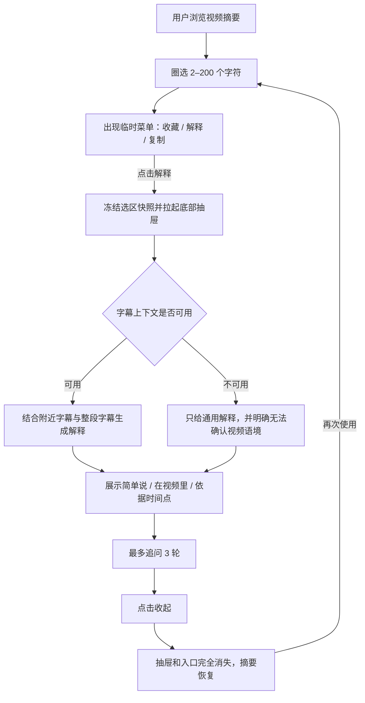
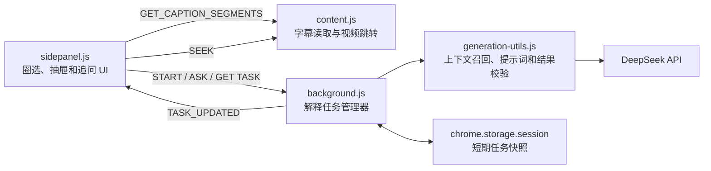

# Skimline 圈选解释底部抽屉：完整开发方案

## 1. 方案结论

本次改造采用以下唯一交互路径：

> 圈选摘要文字 → 出现临时操作菜单 → 点击“解释” → 拉起底部抽屉 → 在抽屉内阅读和追问 → 点击“收起”后完全退出。

收起后不在摘要底部保留“展开解释”、抽屉把手或其他常驻入口。用户如果想再次解释，需要重新圈选文字。

这次不是重做 AI 解释能力。当前版本已经具备圈选捕获、字幕读取、视频语境召回、通用定义补充、真实时间戳依据和最多三轮追问。本次开发主要解决：

1. 把当前悬浮解释卡片改为不会无限拉长页面的底部抽屉。
2. 让解释请求脱离 Side Panel 当前页面生命周期，切换标签页或 Side Panel 暂时不可见时继续执行。
3. 区分“收起界面”和“取消任务”，避免用户只是离开界面就丢失已进行的工作。
4. 建立可恢复的任务状态、完整异常降级和对抗性测试。

当前代码基线已执行 `npm test`：126 项测试全部通过。后续开发应在这一基线上增量修改，不能以删除既有断言的方式掩盖回归；只有“显式关闭会取消解释”这一条旧契约需要按新交互有意识地改写。

---

## 2. 产品目标与非目标

### 2.1 本期目标

1. 用户可以在概览、观点、展开详情和核心洞见中圈选 2–200 个字符。
2. 圈选后出现现有的“收藏 / 解释 / 复制”临时菜单。
3. 点击“解释”后，菜单消失并从底部拉起解释抽屉。
4. 抽屉有独立且唯一的纵向滚动区，摘要页面不跟随抽屉内容变长。
5. 点击抽屉内“收起”后，抽屉、遮罩和圈选高亮全部消失。
6. 收起后摘要恢复完整可用空间，不保留底部按钮。
7. 用户切换浏览器标签页、YouTube 页面或暂时关闭 Side Panel 时，已经开始的解释任务不被中断。
8. 用户回到来源视频后，可以恢复仍在进行或已经完成的解释。
9. 每次解释最多追问 3 轮，旧回答不会无限撑高界面。
10. 字幕不可用、请求超时、视频切换、重复圈选和 Service Worker 重启都有明确结果。

### 2.2 本期不做

- 不提供底部常驻“展开解释”按钮。
- 不自动识别并标注页面里所有专业术语。
- 不提供脱离圈选内容的开放式视频聊天。
- 不跨视频进行知识问答。
- 不把解释和追问永久保存到洞见库。
- 不增加账号、云同步或服务端数据库。
- 不更换模型供应商或引入新的 Chrome 权限。
- 不允许模型给出无法映射到真实字幕的“视频依据”时间戳。

---

## 3. 完整用户流程



### 3.1 圈选

- 允许圈选区域沿用当前实现：
  - `#yvpm-overview-text`
  - `.yvpm-claim`
  - `.yvpm-detail p`
  - `.yvpm-insight-card-why`
  - `.yvpm-insight-card-detail`
- 少于 2 个字符：不显示操作菜单。
- 超过 200 个字符：不显示菜单，并提示“选择一小段内容，解释会更准确”。
- 跨越两个观点或两个不同容器：不支持，避免无法确定时间锚点。
- 菜单优先显示在选区上方；空间不足时显示在下方。
- 菜单是瞬时入口，不属于抽屉的展开/收起状态。

### 3.2 打开抽屉

点击“解释”时立即完成以下动作：

1. 将选区内容、位置、视频、语言和所属观点冻结为不可变快照。
2. 隐藏圈选操作菜单。
3. 保留 CSS Highlight，帮助用户理解正在解释哪段内容。
4. 拉起抽屉，不等待字幕或模型请求完成。
5. 抽屉先显示“正在读取视频上下文…”。
6. 字幕准备完成后切换为“正在结合整段视频解释…”。

### 3.3 抽屉内容

抽屉从上到下包含：

1. 拖动视觉提示，仅用于表达“这是底部抽屉”，第一版不实现拖拽高度。
2. 标题区：
   - `AI 上下文解释`
   - 圈选内容，单行省略
   - `收起`按钮
3. 单一滚动内容区：
   - 简单说
   - 在这段视频里
   - 最多 3 个可跳转依据
   - 不确定性说明
   - 追问记录
   - 推荐追问
4. 底部输入区：
   - 继续追问输入框
   - 发送按钮
   - 当前轮数 `n / 3`

### 3.4 追问过长的处理

- 抽屉自身固定高度，不随追问增加而变高。
- 内容区是唯一滚动容器。
- 底部输入区固定在抽屉底部。
- 最新一轮回答默认展开。
- 从第二轮追问开始，较早问答折叠为问题摘要，用户可按需展开。
- 当用户主动向上阅读历史时，新回答到达不强制抢走滚动位置，显示“回到最新回答”。
- 达到 3 轮后移除输入框，显示“重新圈选内容可以开始新的解释”。

### 3.5 收起

点击“收起”、按 `Escape` 或切换到洞见库时：

1. 抽屉整体向下退出。
2. 遮罩变为透明并移除点击拦截。
3. 清除浏览器原生选区和 CSS Highlight。
4. 摘要恢复完整滚动空间。
5. 不显示底部入口、把手或恢复按钮。
6. 焦点回到原观点容器；原 DOM 已变化时回到摘要主区域。

“收起”只改变界面状态，不直接取消已经发出的模型请求。这样用户切换页面或误收起时不会丢失结果。

如果用户随后圈选了另一段内容，系统才取消同一客户端尚未完成的旧解释任务，避免并发浪费。

---

## 4. 状态机

界面状态与后台任务状态必须分离，禁止继续使用一个 `hidden` 字段同时表达“界面是否打开”和“请求是否存在”。

### 4.1 界面状态

```text
idle
  └─ valid_selection → selection_menu
selection_menu
  ├─ selection_cleared → idle
  ├─ click_copy/save → idle
  └─ click_explain → drawer_open
drawer_open
  ├─ collapse/escape → idle
  ├─ followup_submit → drawer_open
  └─ video_or_library_change → suspended
suspended
  ├─ return_to_source_video AND not_explicitly_dismissed → drawer_open
  └─ explicit_dismiss/new_selection → idle
```

### 4.2 后台任务状态

```text
none
  → preparing_context
  → queued
  → running
  → complete

preparing_context / queued / running
  → failed
  → cancelled
  → recovering
```

### 4.3 关键事件规则

| 事件 | 界面 | 后台任务 |
|---|---|---|
| 点击“解释” | 打开抽屉 | 创建或复用任务 |
| 点击“收起” | 完全关闭并标记已主动收起 | 继续运行 |
| 切换浏览器标签页 | 暂停展示 | 继续运行 |
| 回到来源视频 | 恢复未主动收起的抽屉 | 读取任务最新状态 |
| 重新圈选同一内容 | 再次打开 | 复用运行中或已完成任务 |
| 重新圈选不同内容 | 打开新抽屉 | 取消同客户端旧任务，创建新任务 |
| 切换摘要语言 | 关闭旧抽屉 | 取消旧语言任务 |
| 来源视频标签页关闭 | 关闭抽屉 | 任务可完成，但不再提供视频跳转 |
| Side Panel 关闭 | 无界面 | 任务继续并写入会话状态 |
| Service Worker 重启 | 无影响 | 从会话快照恢复或重试一次 |

---

## 5. 系统架构



### 5.1 为什么任务必须放在 Background

当前解释请求通过 Side Panel 的一次 `runtime.sendMessage` 等待完整响应。界面关闭、重新加载或切换状态时，UI 本地的请求标识和结果容易丢失。

新方案中，Side Panel 只负责：

- 捕获圈选；
- 打开、收起和渲染抽屉；
- 订阅任务；
- 发起追问。

Background 负责：

- 去重；
- 请求排队；
- 取消旧任务；
- 维护运行状态；
- 临时持久化；
- Service Worker 恢复；
- 广播完成或失败事件。

### 5.2 字幕策略

解释上下文按以下优先级获得：

1. 复用 `state.overviewCaptions`。
2. 复用当前视频已经存在的 `state.explanationCaptions`。
3. 复用 `content.js` 的视频级 LRU 字幕缓存。
4. 重新读取播放器字幕轨道。
5. 使用官方文字记录 DOM fallback。
6. 字幕仍不可用时，只生成通用解释，并明确标记“无法确认视频中的具体含义”。

同一视频的字幕读取必须合并为一个 in-flight Promise，不能因为摘要、解释和追问分别读取三次。

后台只持久化经过召回的紧凑上下文，不持久化整段字幕：

- 当前时间附近字幕；
- 从整段字幕召回的相关片段；
- 最多 8,000 字的视频观点地图；
- 选区上下文。

---

## 6. 消息协议

### 6.1 创建或复用解释任务

```js
{
  type: "START_CONTEXT_EXPLANATION",
  payload: {
    clientId,
    videoId,
    sourceTabId,
    targetLanguage,
    sourceLang,
    selection: {
      selectedText,
      anchorT,
      anchorContext,
      sourceType,
      pointText,
      sectionTitle
    },
    videoOutline,
    segments
  }
}
```

立即返回：

```js
{
  ok: true,
  task: {
    taskId,
    status: "preparing_context" | "queued" | "running" | "complete",
    reused: false
  }
}
```

### 6.2 获取状态

```js
{
  type: "GET_CONTEXT_EXPLANATION_TASK",
  taskId
}
```

### 6.3 继续追问

```js
{
  type: "ASK_CONTEXT_EXPLANATION",
  payload: {
    taskId,
    question,
    expectedTurn
  }
}
```

`expectedTurn` 用于防止用户快速点击导致同一轮重复提交。

### 6.4 取消

```js
{
  type: "CANCEL_CONTEXT_EXPLANATION",
  taskId,
  reason: "superseded" | "language_changed" | "video_closed"
}
```

收起抽屉不发送取消消息。为了避免 Side Panel 重载后把用户主动收起的抽屉再次打开，需要单独发送不影响任务运行的展示状态：

```js
{
  type: "DISMISS_CONTEXT_EXPLANATION",
  taskId
}
```

Background 将任务标记为 `dismissed: true`，但不会 Abort 请求。用户重新圈选同一内容时，`START_CONTEXT_EXPLANATION` 复用结果并把 `dismissed` 恢复为 `false`。

### 6.5 Background 广播

```js
{
  type: "CONTEXT_EXPLANATION_TASK_UPDATED",
  taskId,
  videoId,
  status,
  result,
  history,
  turns,
  error
}
```

Side Panel 收到消息后必须同时校验 `taskId`、`videoId` 和 `targetLanguage`，防止旧视频结果写入当前抽屉。

---

## 7. 会话数据模型

存储位置：`chrome.storage.session`。

原因：

- 可以跨 Side Panel 重载和 Service Worker 重启恢复；
- 浏览器退出后自动清理；
- 不把用户解释历史长期保存在本机；
- 已有 `storage` 权限，无需新增权限。

```js
{
  schemaVersion: 1,
  taskId: "explain-task-...",
  taskKey: "videoId:language:selectionFingerprint:promptVersion",
  clientId: "panel-...",
  videoId: "I4B37S1dyQQ",
  sourceTabId: 123,
  targetLanguage: "zh-CN",
  sourceLang: "en",
  status: "running",
  selection: {
    selectedText: "AlexNet",
    anchorT: 623,
    anchorContext: "...",
    sourceType: "claim",
    pointText: "...",
    sectionTitle: "..."
  },
  compactContext: {
    nearbyTranscript: [],
    relatedTranscript: [],
    videoOutline: "..."
  },
  result: null,
  history: [],
  turns: 0,
  pendingQuestion: "",
  dismissed: false,
  attempt: 1,
  createdAt: 1785300000000,
  updatedAt: 1785300000000,
  expiresAt: 1785307200000
}
```

规则：

- 会话 TTL：2 小时。
- 完成、失败和取消任务都按 TTL 清理。
- API Key、完整字幕和原始 SSE 内容禁止写入任务快照。
- `taskKey` 使用规范化选区、视频、语言、时间锚点和提示词版本生成。
- 相同 `taskKey` 的运行中或已完成任务直接复用。
- `clientId` 只代表当前 Side Panel 实例，任务恢复不能仅依赖它；Side Panel 重载后按 `videoId + taskId + dismissed` 恢复。

---

## 8. 前端实现方案

### 8.1 `sidepanel.html`

保留现有圈选菜单，将当前 `#yvpm-explanation-card` 替换为：

```html
<div id="yvpm-explanation-scrim" hidden></div>
<article
  id="yvpm-explanation-drawer"
  role="dialog"
  aria-modal="true"
  aria-labelledby="yvpm-explanation-title"
  data-state="closed"
  hidden
>
  <div class="yvpm-explanation-grabber" aria-hidden="true"></div>
  <header class="yvpm-explanation-header">
    <div>
      <span>AI 上下文解释</span>
      <h2 id="yvpm-explanation-title"></h2>
    </div>
    <button id="yvpm-explanation-collapse" type="button">收起</button>
  </header>
  <div id="yvpm-explanation-scroll"></div>
  <footer id="yvpm-explanation-composer"></footer>
</article>
```

收起状态下，DOM 可以继续存在以保留结果，但必须满足：

- `transform: translateY(calc(100% + 2px))`
- `opacity: 0`
- `pointer-events: none`
- `inert`
- `aria-hidden="true"`

### 8.2 `sidepanel.css`

抽屉规格：

- 顶部不高于 App Bar 底边。
- 推荐高度 `min(91vh, calc(100vh - 52px))`。
- 小屏下最少保留 52px App Bar。
- `grid-template-rows: auto auto minmax(0, 1fr) auto`。
- 只有 `#yvpm-explanation-scroll` 可以纵向滚动。
- `overscroll-behavior: contain`，避免滚动穿透摘要。
- 遮罩收起时 `opacity: 0; pointer-events: none`。
- 打开动画 220–260ms，遵守 `prefers-reduced-motion`。
- 85%–125% 文字缩放下不能出现横向滚动。
- 明暗主题继续使用现有 token，不新增独立硬编码主题。

### 8.3 `sidepanel.js`

必须进行的结构拆分：

1. `showExplanationCard()` → `openExplanationDrawer()`
2. 删除 `positionExplanationCard()` 和窗口滚动跟随定位。
3. 当前 `closeExplanation()` 拆成：
   - `collapseExplanationDrawer()`：只关闭 UI，不取消任务；
   - `resetExplanationSession()`：新选区、语言切换或视频彻底失效时清理数据；
   - `cancelExplanationTask()`：只在明确取消条件下通知 Background。
4. 新增：
   - `renderExplanationTask(task)`
   - `attachExplanationTask(taskId)`
   - `restoreExplanationTaskForVideo(videoId)`
   - `setExplanationDrawerState(state)`
5. `captureExplainableSelection()` 在抽屉打开时继续禁止捕获新选区。
6. 点击“解释”时先打开抽屉，再请求字幕和启动任务。
7. 追问输入放入固定 Footer，不再每次整体替换整个抽屉 DOM。
8. 旧问答使用折叠组件，最新回答到达时执行滚动位置保护。
9. `handleActiveTabChanged()` 不再因为抽屉打开而阻止活动标签同步；改为保存当前展示状态、同步新标签，再按来源视频决定是否恢复。
10. `clearPoints()` 不再无条件调用会取消任务的关闭函数；摘要重渲染只让选区 Range 失效，不得影响 Background 任务。
11. 恢复任务时旧 Range 通常已经失效：可以按 `anchorT` 找回对应观点行；找不到时仍恢复抽屉，但不伪造文字高亮。

### 8.4 `background.js`

用以下结构替换当前仅按 `clientId` 保存 `AbortController` 的方式：

```js
const explanationJobs = new Map();       // taskId -> task
const explanationTaskKeys = new Map();   // taskKey -> taskId
const explanationControllers = new Map();// taskId -> AbortController
```

新增能力：

- 创建或复用任务；
- 每个客户端最多一个未完成的不同选区任务；
- 最多并行 2 个解释请求；
- 任务状态写入 `chrome.storage.session`；
- Service Worker 初始化时恢复任务；
- `running` 状态在重启后变成 `recovering`，最多重试一次；
- 完成和失败后广播；
- 定期清理过期任务。

### 8.5 `generation-utils.js`

保留当前提示词原则和结果验证，新增一个可序列化的准备阶段：

```js
prepareContextExplanation(input)
requestPreparedContextExplanation(prepared, options)
```

准备阶段负责：

- 验证选区长度；
- 生成附近字幕；
- 全视频相关片段召回；
- 生成允许使用的证据时间集合；
- 压缩历史对话；
- 输出适合写入 `storage.session` 的紧凑上下文。

请求阶段负责：

- 模型调用；
- JSON 重试；
- 超时；
- 真实时间戳校验；
- 通用定义和视频语境分离；
- 不确定性标记。

---

## 9. 异常和降级

| 场景 | 用户看到的状态 | 系统行为 |
|---|---|---|
| 字幕读取较慢 | 正在读取视频上下文… | 复用 in-flight 请求，不重复读取 |
| 文字记录超时 | 暂时无法读取完整字幕 | 允许重试；可降级为通用解释 |
| 无字幕视频 | 可以解释术语，但无法确认视频语境 | `inVideo` 不生成确定性结论 |
| API 超时 | 解释请求超时，请重试 | 保留选区快照和重试入口 |
| HTTP 401/403 | API Key 无效或没有权限 | 引导到设置页，不自动重试 |
| HTTP 429 | 请求较多，请稍后重试 | 指数退避一次，不并发重发 |
| 返回无效 JSON | 正在重新整理解释… | 自动重试一次 |
| 视频已切换 | 抽屉从当前摘要退出 | 后台任务继续，结果绑定原视频 |
| 用户收起时仍在生成 | Toast：已收起，解释会继续生成 | 不取消任务 |
| 用户重新选择不同内容 | 新抽屉打开 | 取消旧的未完成解释 |
| 来源标签页已关闭 | 解释仍可阅读，视频依据无法跳转 | 禁用依据按钮并说明原因 |
| Service Worker 重启 | 正在恢复解释… | 从会话快照重试一次 |

---

## 10. 可访问性

- 圈选菜单保持 `role="menu"`，按钮使用 `role="menuitem"`。
- 抽屉使用 `role="dialog"` 和 `aria-modal="true"`。
- 打开抽屉后焦点进入标题区或首个可操作元素。
- 抽屉打开时摘要区域设置 `inert`，但不影响 YouTube 主页面。
- `Escape` 等价于“收起”。
- 收起后焦点返回原观点容器。
- Loading、完成、失败使用节制的 `aria-live="polite"`，不能反复朗读整个答案。
- 折叠历史问答使用原生 `<details>` 或完整的 `aria-expanded`。
- 所有动画支持 `prefers-reduced-motion`。
- 125% 字体下标题、依据和追问输入不溢出。

---

## 11. 性能、隐私与安全

### 11.1 性能

- 同一视频字幕只保留一个 in-flight 请求。
- 相同选区、语言和提示词版本的解释任务复用。
- 每个任务只保存紧凑上下文。
- 解释请求最多并行 2 个。
- 追问必须串行，上一轮未完成时禁用再次提交。
- DOM 中只保留最多 3 轮追问。

### 11.2 隐私

- API Key 仍只保存在 `chrome.storage.local`。
- 完整字幕不写入长期存储。
- 解释任务只写入 `chrome.storage.session`，浏览器退出后清理。
- 解释内容不自动加入洞见库。
- README 必须补充“短期解释会话”的存储说明。

### 11.3 安全

- 所有模型输出使用 `textContent` 渲染，禁止直接写入 `innerHTML`。
- 证据时间只接受召回字幕中真实存在的时间。
- `selectedText`、问题和历史都有长度限制。
- `clientId`、`taskId` 和 `videoId` 进行格式和长度校验。
- 字幕 URL 继续沿用现有来源白名单与 MAIN world 隔离。
- 任务广播必须校验视频、语言和任务 ID，防止旧响应污染当前 UI。

---

## 12. 测试方案

### 12.1 单元测试

新增或修改：

- `test/generation-utils.test.js`
  - 紧凑上下文可以序列化；
  - 附近字幕优先；
  - 整段字幕召回；
  - 通用解释降级；
  - 真实证据时间约束；
  - 历史最多 3 轮；
  - 追问重复提交保护。
- `test/background-caption-bridge.test.js`
  - 创建解释任务立即返回；
  - 相同任务复用；
  - 收起不取消；
  - 新选区取消旧任务；
  - 标签页切换不取消；
  - Service Worker 快照恢复；
  - 任务 TTL 清理；
  - 同时最多两个解释任务。
- `test/extension-structure.test.js`
  - 新抽屉节点和收起按钮存在；
  - 不存在底部常驻“展开解释”按钮；
  - 抽屉收起态包含 `pointer-events: none` 和位移动画；
  - 旧的悬浮卡片定位逻辑被删除。

### 12.2 交互集成测试

在 `test/harness.html` 增加：

1. 圈选 AlexNet。
2. 验证菜单出现。
3. 点击“解释”。
4. 验证菜单消失、抽屉打开、摘要 inert。
5. 返回解释结果。
6. 连续追问 3 轮。
7. 验证抽屉高度不增加、只有内部滚动。
8. 点击“收起”。
9. 验证：
   - 抽屉完全在视口外；
   - 遮罩透明；
   - `pointer-events: none`；
   - 摘要可点击；
   - 页面没有“展开解释”按钮。
10. 再次圈选，验证操作菜单重新出现。

### 12.3 恢复测试

- 生成中切换到另一个 YouTube 标签页，再返回。
- 生成中关闭并重新打开 Side Panel。
- Background 运行中模拟 Service Worker 重启。
- 结果完成时没有 Side Panel 订阅者。
- 回到来源视频后恢复完成结果。
- 主动收起后返回视频不自动拉起抽屉。

### 12.4 对抗性测试

- 快速连续圈选 10 次。
- 解释按钮双击。
- 追问发送按钮连续点击。
- 圈选内容在摘要重新渲染后 Range 失效。
- 生成中切换语言两次。
- 生成中来源标签页关闭。
- 生成中 API 返回 429、500、断流和非法 JSON。
- 3 小时视频和超大字幕。
- 85%、100%、125% 字体。
- 320px、390px、500px 侧栏宽度。
- 浅色、深色和减少动画模式。
- 键盘圈选、Tab、Shift+Tab、Escape。
- 抽屉滚动到底部后继续追问。
- 用户阅读历史时新回答到达。
- 相同时间点出现多条字幕。
- AI 尝试返回不存在的时间戳。

---

## 13. 开发任务拆分

### 阶段 A：UI 抽屉改造

- 替换 HTML 结构。
- 完成抽屉、遮罩、滚动区和固定输入区样式。
- 拆分打开、收起和重置函数。
- 保持现有解释请求不变，先完成 UI 等价替换。
- 完成尺寸、主题和键盘测试。

预计：1.5–2 人日。

### 阶段 B：后台任务化

- 建立解释任务 Map、任务键和队列。
- 增加 START / GET / ASK / CANCEL 消息协议。
- Side Panel 改为订阅和恢复任务。
- 收起与取消解耦。

预计：2–2.5 人日。

### 阶段 C：恢复与字幕降级

- `chrome.storage.session` 快照。
- Service Worker 恢复。
- 字幕读取去重。
- 无字幕通用解释降级。
- 视频和标签页切换恢复。

预计：1.5–2 人日。

### 阶段 D：测试与对抗性审查

- 单元测试。
- Harness 集成测试。
- Chrome 真机流程。
- 320–500px 宽度和 85%–125% 字号回归。
- 打包产物与隐私文档检查。

预计：1.5–2 人日。

总计：约 6.5–8.5 人日，不包含模型提示词的额外产品调优。

---

## 14. 灰度策略

第一阶段使用本地 Feature Flag：

```js
const CONTEXT_EXPLANATION_DRAWER_V2 = true;
```

灰度顺序：

1. 开发环境只切换 UI，确认解释质量没有回归。
2. 开启 Background 任务化，重点观察中断、重复请求和恢复。
3. 进行至少 10 个不同长度、不同语言视频的人工测试。
4. 通过对抗性审查后替换旧卡片实现。
5. 保留旧实现一个发布周期的回滚分支，不在运行时代码中长期保留两套 UI。

如果产品以后接入分析系统，建议观察：

- 圈选菜单出现 → 点击解释的转化率；
- 解释完成率；
- 字幕读取失败率；
- 首次解释耗时 P50/P95；
- 追问率和完成三轮比例；
- 收起后重新圈选同一内容的比例；
- 页面切换后的任务恢复成功率。

当前版本没有分析后端，因此第一版只保留开发日志，不新增外部数据上报。

---

## 15. Definition of Done

只有同时满足以下条件才算开发完成：

- [ ] 圈选入口是唯一的打开方式。
- [ ] 收起后没有底部“展开解释”按钮。
- [ ] 抽屉收起后不占摘要空间、不拦截点击。
- [ ] 追问增加不会改变抽屉外部高度。
- [ ] 切换标签页或 Side Panel 不会取消解释任务。
- [ ] 回到来源视频可以恢复任务。
- [ ] 主动收起后不会自动重新打开。
- [ ] 新选区不会被旧请求结果覆盖。
- [ ] 字幕不可用时不虚构视频语境。
- [ ] 依据时间全部来自真实字幕。
- [ ] 最多追问 3 轮。
- [ ] 85%–125% 文字缩放和明暗主题通过。
- [ ] 键盘与屏幕阅读器关键路径可用。
- [ ] `npm test` 全部通过。
- [ ] `npm run build:release` 成功。
- [ ] 打包文件不包含 API Key 或调试凭据。
- [ ] 完成一次独立的对抗性审查，并记录所有发现与结论。

---

## 16. 对当前代码的直接改造清单

| 文件 | 当前能力 | 本次改造 |
|---|---|---|
| `sidepanel.html` | 圈选菜单 + 悬浮解释卡片 | 改为遮罩 + 底部抽屉 + 收起按钮 |
| `sidepanel.css` | 卡片按选区上下定位 | 删除动态定位；增加固定抽屉、单滚动区和过渡 |
| `sidepanel.js` | 解释状态与卡片显示绑定 | UI 状态和任务状态拆分；增加任务恢复 |
| `background.js` | 每个客户端一个 AbortController | 增加任务 Map、队列、持久化和消息协议 |
| `generation-utils.js` | 完整字幕召回并直接请求 | 拆分可序列化准备阶段和请求阶段 |
| `content.js` | 视频级字幕 LRU 和 in-flight 去重 | 保留；补充后台任务调用与来源标签页失效处理 |
| `test/harness.html` | 圈选后自动打开旧卡片 | 改为验证抽屉完整生命周期 |
| `README.md` | 说明解释卡片且不缓存 | 更新为抽屉与短期会话恢复说明 |

这套方案不需要改 `manifest.json` 权限范围，也不需要新增服务端。

### 16.1 当前实现中必须同步修改的高风险点

1. `closeExplanation()` 当前会先调用 `cancelExplanationRequest()`。不能只改 CSS，否则点击“收起”仍会中止模型请求。
2. `handleActiveTabChanged()` 当前在解释卡打开时延迟活动标签同步。任务化后必须改为“UI 暂停、标签正常同步、任务后台继续”，否则 Side Panel 会继续显示旧视频状态。
3. `clearPoints()` 当前会在摘要重绘时关闭解释。新实现必须区分 DOM Range 失效与解释任务失效。
4. `renderExplanationCard()` 当前通过 `replaceChildren()` 重建整块内容。抽屉版应保持固定 Header、Scroll 和 Composer，避免追问返回时丢失输入焦点与滚动位置。
5. 当前 Background 测试明确断言“显式关闭会取消解释”。这一契约必须改为：
   - 收起不取消；
   - 新选区、语言切换和明确取消才 Abort；
   - Side Panel 重载可以通过任务 ID 恢复。
6. 当前选区高亮依赖 DOM Range。摘要流式更新、语言切换或恢复缓存后 Range 可能失效，恢复逻辑必须依赖冻结的选择快照和 `anchorT`，不能依赖旧 DOM 引用。
