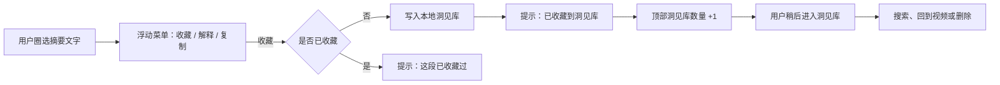

# Skimline 圈选收藏与洞见库开发方案

## 1. 产品决定

收藏功能只采用一种交互入口：

> 用户圈选摘要中的文字，点击“收藏”，将所选内容保存到本地洞见库。

不增加观点行收藏按钮，不区分“模型核心洞见”和“普通观点”的收藏权限。模型负责整理内容，用户决定什么值得留下。

现有圈选菜单从：

`解释这段｜复制`

调整为：

`收藏｜解释｜复制`

“收藏”是主操作，点击后立即保存，不弹出备注、标签或确认框。

---

## 2. 目标与非目标

### 2.1 第一版目标

1. 概览、观点、观点详情、核心洞见说明均可圈选收藏。
2. 点击收藏后立即写入 `chrome.storage.local`。
3. 收藏内容在切换视频、关闭 Side Panel、重启 Chrome 后仍然存在。
4. 用户可以从 Side Panel 顶部进入洞见库。
5. 洞见库支持搜索、回到来源视频、删除与撤销删除。
6. 收藏与搜索过程不调用 AI，不发送新的网络请求。

### 2.2 第一版明确不做

- 不提供整条观点收藏按钮。
- 不保存未被用户圈选的完整摘要。
- 不提供个人备注。
- 不提供标签、文件夹或 AI 自动分类。
- 不提供云同步、多设备同步或账号系统。
- 不导出 Markdown、Notion 或其他格式。
- 不收藏 AI 上下文解释卡片或追问记录。
- 不做每周回顾、相似观点聚合和知识图谱。

这些能力以后可以基于真实收藏量和回访数据决定是否增加。

---

## 3. 完整用户流程



### 3.1 收藏

1. 用户在以下区域圈选 2–200 个字符：
   - 视频概览；
   - 观点标题；
   - 普通观点详情；
   - 核心洞见的“为什么重要”；
   - 核心洞见详情。
2. 浮动菜单显示在选区上方或下方。
3. 用户点击“收藏”。
4. 系统使用已经捕获的选区快照保存，不依赖点击后仍然存在的 DOM Range。
5. 保存成功：
   - 关闭浮动菜单；
   - 清除浏览器原生选区；
   - Toast 显示“已收藏到洞见库”；
   - 顶部洞见库计数更新。
6. 如果同一段内容已经收藏：
   - 不重复写入；
   - Toast 显示“这段已收藏过”。
7. 保存失败：
   - 不清除当前选区；
   - Toast 显示“收藏失败，请重试”。

### 3.2 查看洞见库

1. Side Panel 顶部增加洞见库图标和收藏数量。
2. 点击图标后，当前视频摘要视图切换为洞见库视图。
3. 洞见库默认按 `savedAt` 倒序排列。
4. 每张卡片展示：
   - 用户圈选的原文；
   - 视频标题；
   - 时间戳（如果选区来自某条观点）；
   - 收藏日期；
   - 回到来源视频；
   - 删除。
5. 点击来源：
   - 有时间戳时打开 `watch?v=<videoId>&t=<anchorT>s`；
   - 概览收藏没有确定时间戳，从视频开头打开；
   - 使用当前标签页导航，不额外创建大量 YouTube 标签页。
6. 点击返回恢复视频摘要视图和之前的滚动位置。
7. 即使当前标签页不是 YouTube 视频，顶部洞见库入口仍然可用；返回后显示原有空状态。

### 3.3 搜索

- 搜索在本地即时执行，不调用模型。
- 匹配字段：
  - `selectedText`；
  - `videoTitle`；
  - `pointText`；
  - `sectionTitle`。
- 搜索忽略大小写，并压缩连续空白。
- 没有结果时显示：“没有找到相关收藏，换个关键词试试。”

### 3.4 删除

1. 点击卡片删除按钮后立即从列表移除。
2. Toast 显示“已删除”，同时提供“撤销”操作。
3. 撤销在当前 Toast 生命周期内有效。
4. 不使用确认弹窗，避免频繁打断；通过撤销保证操作可恢复。

---

## 4. 信息架构与界面规格

### 4.1 顶部入口

在 `.yvpm-app-controls` 中增加：

```html
<button
  id="yvpm-library-button"
  class="yvpm-library-button"
  type="button"
  aria-label="打开洞见库，已收藏 8 条"
>
  <span aria-hidden="true">书签图标</span>
  <span id="yvpm-library-count">8</span>
</button>
```

规则：

- 数量为 0 时不显示数字徽标。
- 数量变化只做一次轻微缩放，不持续闪烁。
- 125% 文字缩放下不能挤压语言按钮或造成水平滚动。

### 4.2 圈选菜单

菜单使用紧凑文案，避免 390px Side Panel 中溢出：

```text
[ 收藏 ] [ ✦ 解释 ] [ 复制 ]
```

- “收藏”使用现有暖金色主按钮样式。
- “解释”和“复制”使用深色菜单中的次级样式。
- 菜单保持现有 `mousedown.preventDefault()`，防止点击菜单时选区提前消失。
- 键盘用户圈选后也能通过 Tab 聚焦菜单按钮。

### 4.3 洞见库视图

在 `sidepanel.html` 中增加与 `#yvpm-panel` 同级的 `#yvpm-library`：

```text
‹ 返回        洞见库 · 18 条
┌──────────────────────────┐
│ 搜索收藏内容或视频标题      │
└──────────────────────────┘

“小团队的优势不是成本更低，而是
方向错误时还能迅速转向。”

如何建立高判断力团队 · 12:48
2026-07-29                  ⋯
```

状态必须覆盖：

- 正常列表；
- 空收藏；
- 搜索无结果；
- 读取失败；
- 删除后的撤销状态。

### 4.4 首次提示

首次成功显示摘要后，仅提示一次：

> 圈选摘要中的文字，可以收藏、解释或复制。

使用设置键 `skimline_clipping_hint_seen_v1` 记录是否展示。后续不再主动提示。

---

## 5. 收藏数据模型

存储键：

```js
const CLIPPINGS_STORAGE_KEY = "skimline_saved_clippings_v1";
```

存储内容：

```json
{
  "schemaVersion": 1,
  "revision": 12,
  "items": [
    {
      "id": "82c6b4e0-...",
      "selectedText": "小团队的优势不是成本更低，而是方向错误时还能迅速转向。",
      "videoId": "abcdefghijk",
      "videoTitle": "如何建立高判断力团队",
      "anchorT": 768,
      "sourceType": "claim",
      "pointText": "小团队的优势不是成本更低，而是方向错误时还能迅速转向。",
      "sectionTitle": "从扩张冲动到组织约束",
      "targetLanguage": "zh-CN",
      "savedAt": 1785292800000
    }
  ]
}
```

### 5.1 字段说明

| 字段 | 规则 |
|---|---|
| `id` | `crypto.randomUUID()` 生成 |
| `selectedText` | 压缩连续空白后的用户选区，2–200 字 |
| `videoId` | 当前 YouTube 视频 ID |
| `videoTitle` | 保存时的视频标题快照 |
| `anchorT` | 所属观点的秒数；概览选区为 `null` |
| `sourceType` | `overview`、`claim`、`detail`、`insightWhy`、`insightDetail` |
| `pointText` | 所属观点的标题快照；概览选区为空字符串 |
| `sectionTitle` | 所属自然分区标题；无法确定时为空字符串 |
| `targetLanguage` | 生成该段摘要时使用的语言 |
| `savedAt` | 收藏时间戳 |

### 5.2 为什么保存快照

收藏不能只保存 `videoId + pointT`。摘要可能因为语言切换、提示词升级或重新生成而变化。保存文字、观点和标题快照，才能保证用户以后看到的仍然是当时收藏的内容。

### 5.3 去重规则

以下三项相同视为重复：

```text
videoId
+ anchorT（null 也参与比较）
+ normalize(selectedText)
```

不按 `pointText` 去重，因为同一观点中可能存在多个不同摘录。

不同语言的文本只要 `selectedText` 不同，可以分别收藏。

### 5.4 容量规则

- 第一版最多保存 1000 条。
- 达到上限时不自动删除旧数据，提示用户先整理洞见库。
- 单条文本限制为 200 字，整体数据预计远低于 `chrome.storage.local` 容量。
- 收藏数据与摘要缓存完全独立；清理或升级摘要缓存不能删除收藏。

---

## 6. 代码架构

### 6.1 新增 `collection-utils.js`

放置不依赖 DOM 和 Chrome API 的纯函数：

```js
normalizeClippingText(text)
normalizeClippingsStore(value)
clippingDedupeKey(item)
createClipping(input, now, id)
addClipping(store, item, limit)
removeClipping(store, id)
restoreClipping(store, item)
searchClippings(items, query)
```

文件同时支持浏览器全局和 Node.js `module.exports`，便于直接单元测试。

加载位置：

- `background.js`：`importScripts("generation-utils.js", "collection-utils.js")`
- `sidepanel.html`：在 `sidepanel.js` 前加载 `collection-utils.js`
- 发布脚本和发布包测试中加入该文件

### 6.2 `sidepanel.js` 修改

#### 状态新增

```js
videoTitle: "",
activeView: "summary",
summaryScrollTop: 0,
clippings: [],
clippingSearchQuery: "",
pendingDeletedClipping: null,
```

#### 元素引用新增

```js
saveSelection
libraryButton
libraryCount
libraryView
libraryBack
librarySearch
libraryList
libraryEmpty
```

#### 复用和调整现有函数

- 将 `explanationAllowedContainer()` 改名为更通用的 `selectionAllowedContainer()`。
- `captureExplainableSelection()` 改名为 `captureActionableSelection()`。
- 保留现有：
  - 选区范围校验；
  - 同一允许容器限制；
  - 200 字限制；
  - Range 快照；
  - 菜单定位。
- 在 `explanationAnchorData()` 基础上增加：
  - `sourceType`；
  - `pointText`；
  - `sectionTitle`。
- 新增：

```js
saveCurrentSelection()
loadClippings()
renderClippings()
openLibrary()
closeLibrary()
deleteClipping(id)
undoDeleteClipping()
openClippingSource(item)
```

#### 选区关闭规则

- 点击“收藏”：成功后清除选区。
- 点击“解释”：沿用当前高亮和解释卡片流程。
- 点击“复制”：沿用当前复制后清除菜单的流程。
- 视频切换、语言切换、摘要重新渲染时清除选区状态。

#### Toast 扩展

将现有 `showToast(message)` 扩展为可选操作形式：

```js
showToast(message, {
  actionLabel: "撤销",
  onAction: undoDeleteClipping,
  duration: 4000,
});
```

普通提示继续使用原签名；只有删除收藏需要操作按钮。

### 6.3 `content.js` 修改

扩展 `GET_VIDEO_STATE` 返回值：

```js
{
  videoId,
  duration,
  currentTime,
  videoTitle
}
```

标题获取：

```js
String(document.title || "")
  .replace(/\s*-\s*YouTube\s*$/i, "")
  .trim()
```

如果标题为空，Side Panel 使用 `YouTube 视频 <videoId>` 作为兜底。

第一版不读取频道 DOM，避免依赖 YouTube 易变化的页面选择器。

### 6.4 `background.js` 修改

收藏读写统一由后台处理，避免多个 Side Panel 窗口同时写入时互相覆盖。

新增消息：

```text
LIST_CLIPPINGS
SAVE_CLIPPING
DELETE_CLIPPING
RESTORE_CLIPPING
```

建议响应：

```js
// LIST_CLIPPINGS
{ ok: true, items, revision }

// SAVE_CLIPPING
{ ok: true, item, duplicate: false, count }
{ ok: true, item: existing, duplicate: true, count }

// DELETE_CLIPPING
{ ok: true, deletedItem, count }

// RESTORE_CLIPPING
{ ok: true, item, count }
```

后台维护串行写队列：

```js
let clippingMutationQueue = Promise.resolve();
```

所有新增、删除和恢复操作进入同一个队列，保证“读取—修改—写入”不会在多窗口中交叉覆盖。

### 6.5 跨窗口更新

`sidepanel.js` 监听：

```js
chrome.storage.onChanged.addListener(...)
```

当 `skimline_saved_clippings_v1` 变化时：

- 更新顶部数量；
- 如果洞见库当前打开，重新渲染列表；
- 不影响当前视频摘要和播放跟随状态。

---

## 7. 时间戳和来源规则

### 7.1 观点相关选区

如果允许容器位于 `.yvpm-row` 内：

- `anchorT = Number(row.dataset.t)`；
- `pointText = row.querySelector(".yvpm-claim").textContent`；
- `sourceType` 根据选区所在元素确定；
- `sectionTitle` 从所属 `.yvpm-section` 对应的分区数据获得。

### 7.2 概览选区

概览不是视频中的单一时间点：

- `anchorT = null`；
- `pointText = ""`；
- `sectionTitle = ""`；
- 点击来源时从视频开头打开。

不能使用用户当前播放时间代替概览时间戳，否则会产生错误来源。

### 7.3 来源跳转

```js
const url = new URL("https://www.youtube.com/watch");
url.searchParams.set("v", item.videoId);
if (Number.isFinite(item.anchorT)) {
  url.searchParams.set("t", `${Math.floor(item.anchorT)}s`);
}
```

如果当前活动标签是可更新的 YouTube 标签，使用 `chrome.tabs.update` 导航；失败时再使用 `chrome.tabs.create` 打开来源。

---

## 8. 隐私与安全

- 收藏内容只写入 `chrome.storage.local`。
- 收藏、搜索、删除、去重均不调用 DeepSeek API。
- 不保存完整字幕。
- 不读取浏览历史。
- 不增加新的 Chrome 权限。
- 所有渲染继续使用 `textContent`，禁止把收藏内容写入 `innerHTML`。
- `videoId`、时间戳、文本长度和数据类型在后台再次校验，不能只依赖 UI 校验。

README 隐私范围需要从“不提供笔记”调整为：

> 用户主动圈选收藏的摘要片段只保存在本机，不会因为收藏操作发送新的模型请求。

---

## 9. 边界情况

| 情况 | 处理 |
|---|---|
| 选区跨越两个观点或两个容器 | 不显示菜单 |
| 选区超过 200 字 | 沿用现有提示，引导选择更小片段 |
| 选区不足 2 字 | 不显示菜单 |
| 点击菜单后 Range 消失 | 使用提前保存的 `explanationSelection` 快照 |
| 摘要重新渲染 | 清除旧选区和菜单 |
| 视频切换 | 收藏继续保存；关闭旧选区状态 |
| 当前不是 YouTube 视频 | 不能新增收藏，但仍可进入和管理洞见库 |
| 视频标题暂时为空 | 使用视频 ID 兜底 |
| 同一段连续点击收藏 | 后台去重，只保存一次 |
| 多个 Side Panel 同时收藏 | 后台写队列串行处理 |
| `storage.local` 写入失败 | 保留选区并显示重试提示 |
| 达到 1000 条 | 不自动覆盖，提示先删除旧收藏 |
| 收藏对应摘要缓存已失效 | 仍展示保存时快照 |
| 来源视频已删除或设为私密 | YouTube 页面负责提示；收藏本身保留 |
| 125% 文字大小 | 菜单和卡片不能横向溢出 |
| 深色模式 | 使用已有主题变量，不写死亮色背景 |

---

## 10. 测试方案

### 10.1 新增 `test/collection-utils.test.js`

覆盖：

1. 文本空白规范化。
2. 2–200 字边界。
3. 数据模型字段清洗。
4. 按 `savedAt` 倒序排列。
5. 同视频、同时间、同文本去重。
6. 概览 `anchorT = null` 的去重。
7. 不同摘录不被错误合并。
8. 1000 条上限。
9. 删除和恢复。
10. 中文、英文大小写和空白搜索。
11. 非法旧存储结构回落为空数据。

### 10.2 更新 `test/extension-structure.test.js`

验证：

- `sidepanel.html` 存在收藏按钮和洞见库结构。
- 圈选菜单包含收藏、解释、复制。
- `content.js` 返回 `videoTitle`。
- `background.js` 包含四个收藏消息处理器。
- 不新增权限。
- 不使用收藏内容发起 `fetch` 或模型请求。

### 10.3 新增后台存储测试

使用 mock `chrome.storage.local` 验证：

- 保存成功；
- 重复保存；
- 删除；
- 撤销；
- 多次并发保存不会丢失；
- 存储写入错误正确返回。

### 10.4 UI 手工验证

在 `test/harness.html` 增加可复现收藏数据，验证：

- 概览、普通观点、核心洞见都能圈选；
- 三按钮菜单在 Side Panel 左右边缘不会越界；
- 收藏成功后数量立即变化；
- 搜索和删除状态；
- 回到来源时间戳；
- 85%、100%、125% 字体；
- 浅色和深色模式；
- 键盘圈选和 Escape 关闭。

### 10.5 回归测试

必须继续通过：

```bash
npm test
npm run build:release
unzip -t releases/skimline-<version>-extension.zip
```

重点确认收藏功能不影响：

- 圈选解释和三轮追问；
- 摘要流式渲染；
- 当前观点播放跟随；
- 视频和语言切换；
- 本地摘要缓存；
- Service Worker 恢复。

---

## 11. 验收标准

满足以下条件才算第一版完成：

1. 用户可以在五类摘要区域圈选并收藏 2–200 字。
2. 收藏只需要一次点击，没有强制备注或二次确认。
3. 普通观点和核心洞见的收藏能力完全一致。
4. 收藏后切换视频、关闭 Side Panel、重启 Chrome，内容仍存在。
5. 洞见库可以搜索、删除、撤销删除并跳回来源。
6. 没有活动 YouTube 视频时，洞见库仍然可以打开和搜索。
7. 观点摘录跳转到正确时间；概览摘录不会伪造时间戳。
8. 重复点击不会产生重复收藏。
9. 收藏过程不会产生模型请求或新的网络传输。
10. 不新增 Chrome 权限。
11. 所有自动化测试、发布包校验和手工 UI 验证通过。

---

## 12. 推荐实施顺序

### 阶段一：数据层

1. 新增 `collection-utils.js` 和纯函数测试。
2. 增加后台收藏消息与串行写入。
3. 验证持久化、去重、容量和并发。

### 阶段二：圈选收藏

1. 泛化现有圈选函数命名。
2. 增加来源类型、标题和分区上下文。
3. 增加“收藏”菜单按钮和成功/失败状态。
4. 保证原有解释、复制没有回归。

### 阶段三：洞见库

1. 增加顶部入口与计数。
2. 完成列表、搜索、空状态和返回。
3. 完成来源跳转、删除和撤销。
4. 增加跨窗口存储变化同步。

### 阶段四：收尾

1. 完成暗色、文字缩放、键盘和边界验证。
2. 更新 README、构建脚本和发布包测试。
3. 运行完整测试并生成新发布包。

这个顺序保证每个阶段都可独立验证，不需要先做完整洞见库才能确认圈选收藏是否稳定。
